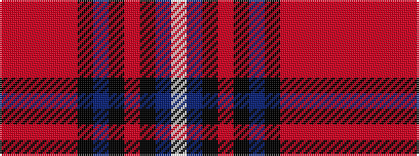

RRRRRKBKRKBW

It is a 12 stripe tartan.

<figure class="pat-woven">

<figcaption>idealised sample</figcaption>
</figure>

## Colour Sequence



## Tartans with this colour sequence

| Tartans |
|---------------|
| [MacLellan of Gartbreck (Personal)](/variants/s12/o3r3o4r4o20k5n4k3o3k2n25w3~x2/)|
||
