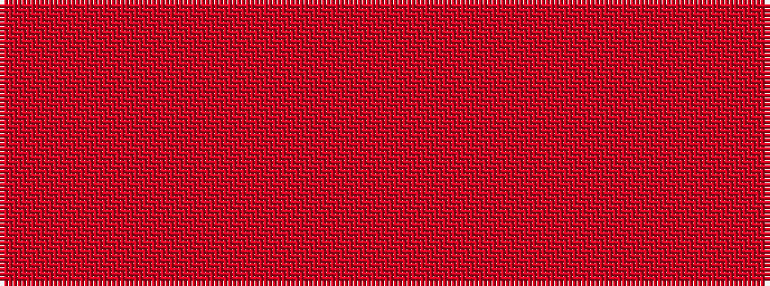

RRRRRR

It is a 6 stripe tartan.

<figure class="pat-woven">

<figcaption>idealised sample</figcaption>
</figure>

## Colour Sequence



## Tartans with this colour sequence

| Tartans |
|---------------|
| [Samye Sangha #2](/setts/s6/ri32r3ri3r2ri3r23~x2/)|
||
| [Youth on The Horizon (Fashion)](/setts/s6/riii2r2ri2r2rii6r1~x8/)|
||
