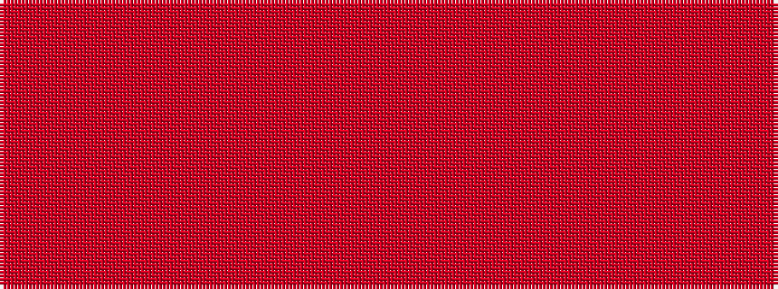

RRRRRRRR

It is a 8 stripe tartan.

<figure class="pat-woven">

<figcaption>idealised sample</figcaption>
</figure>

## Colour Sequence



## Tartans with this colour sequence

| Tartans |
|---------------|
| [Miyuki, House Check Tan, 1004A](/variants/s8/r3o8r3o20oi20o3oi8oi3~x2/)|
||
