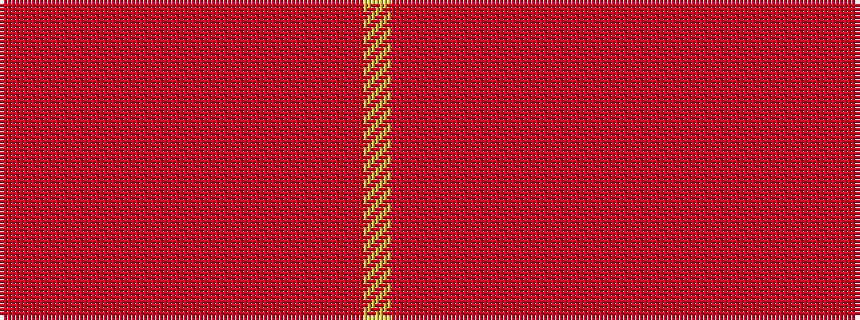

RRRRRRRRRRRRRY

It is a 14 stripe tartan.

<figure class="pat-woven">

<figcaption>idealised sample</figcaption>
</figure>

## Colour Sequence



## Tartans with this colour sequence

| Tartans |
|---------------|
| [Kinloch Anderson Rowanberry](/setts/s14/ly7r30rii4r8rii4ri12r6ri12r28rii4r8rii8r8rii4/)|
||
