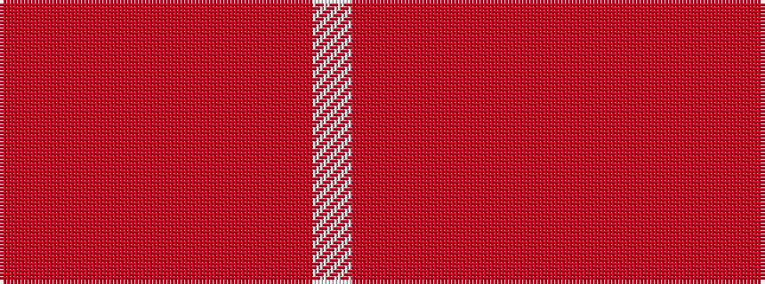

RRRRRRRRW

It is a 9 stripe tartan.

<figure class="pat-woven">

<figcaption>idealised sample</figcaption>
</figure>

## Colour Sequence



## Tartans with this colour sequence

| Tartans |
|---------------|
| [Tune Hotels](/variants/s9/r3ri18rii6r15ri4r3ri4r7w2~x2/)|
||
| [Tune Hotels (Corporate)](/variants/s9/ri3r18rii6ri15r4ri3r4ri7w2~x2/)|
||
