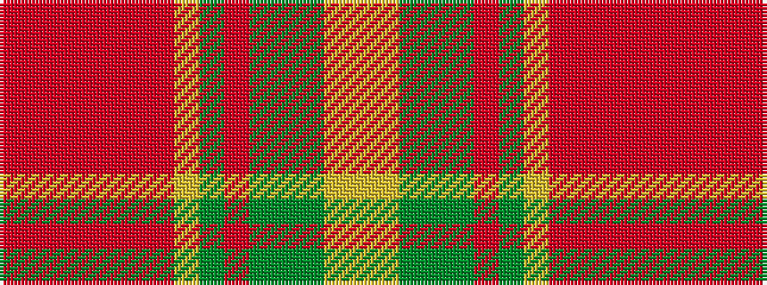

RRRRRRRYGRGGGYY

It is a 15 stripe tartan.

<figure class="pat-woven">

<figcaption>idealised sample</figcaption>
</figure>

## Colour Sequence



## Tartans with this colour sequence

| Tartans |
|---------------|
| [Dixon, Clyde (Personal)](/setts/s15/lg2ly1g2dg8g8o9g3ly2r1o1r1o1r1o1r1~x2/)|
||
