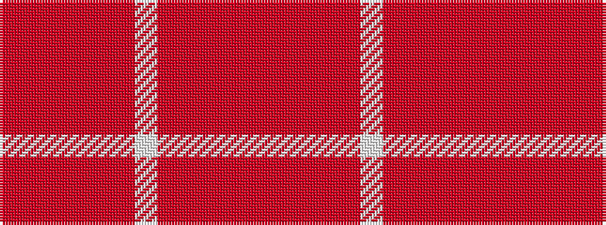

RRRRRRWRRRRR

It is a 12 stripe tartan.

<figure class="pat-woven">

<figcaption>idealised sample</figcaption>
</figure>

## Colour Sequence



## Tartans with this colour sequence

| Tartans |
|---------------|
| [Glen Clova](/variants/s12/oii39oi4oii6o2oii2w2oii2oi12oii6oii2oii6o2~x2/)|
||
