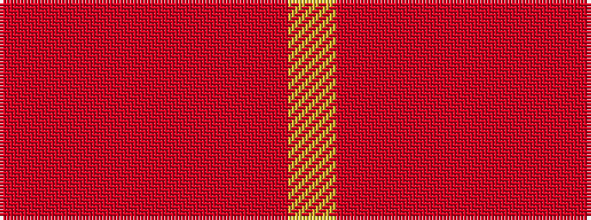

RRRRRRY

It is a 7 stripe tartan.

<figure class="pat-woven">

<figcaption>idealised sample</figcaption>
</figure>

## Colour Sequence



## Tartans with this colour sequence

| Tartans |
|---------------|
| [Burns' Birthplace (Commem)](/setts/s7/o1o1o1o1o4o3lo1~x12/)|
||
