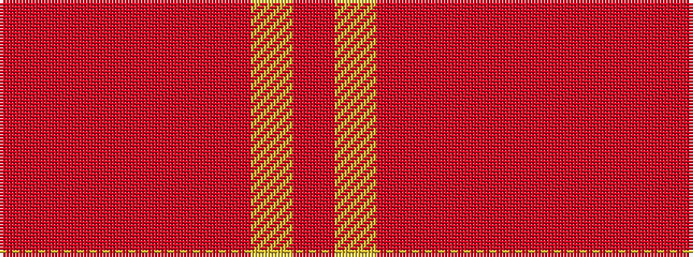

RRRRRRYR

It is a 8 stripe tartan.

<figure class="pat-woven">

<figcaption>idealised sample</figcaption>
</figure>

## Colour Sequence



## Tartans with this colour sequence

| Tartans |
|---------------|
| [Cairngorms National Park](/setts/s8/m57m5m2m8o2m3ly2m14~x2/)|
||
| [Hamilton, Red](/setts/s8/r32lo4r32o23r4o23r4o23~x2/)|
||
