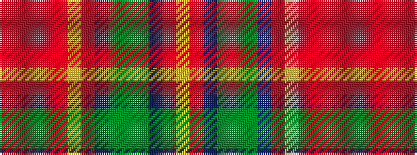

RRRRRYRBGGGBRY

It is a 14 stripe tartan.

<figure class="pat-woven">

<figcaption>idealised sample</figcaption>
</figure>

## Colour Sequence



## Tartans with this colour sequence

| Tartans |
|---------------|
| [Burrell (Personal)](/variants/s14/r29o1r2o1r60lo2r2db10gi2g1gi2db10r2lo2~x2/)|
||
