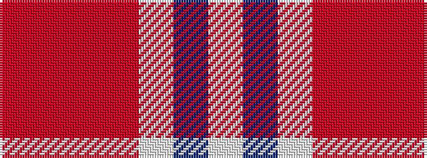

RRRRWBW

It is a 7 stripe tartan.

<figure class="pat-woven">

<figcaption>idealised sample</figcaption>
</figure>

## Colour Sequence



## Tartans with this colour sequence

| Tartans |
|---------------|
| [Lennox Dress #2](/setts/s7/r2ri1r10ri2w10db1w2~x4/)|
||
