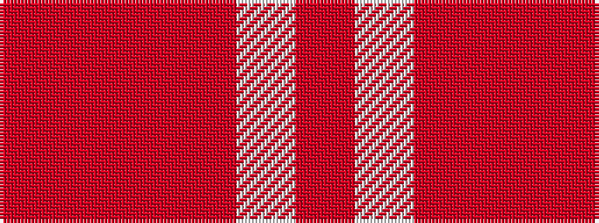

RRRRWR

It is a 6 stripe tartan.

<figure class="pat-woven">

<figcaption>idealised sample</figcaption>
</figure>

## Colour Sequence



## Tartans with this colour sequence

| Tartans |
|---------------|
| [Walsh, Michael Edward (Personal)](/setts/s6/o56w30o8r10o3r20/)|
||
