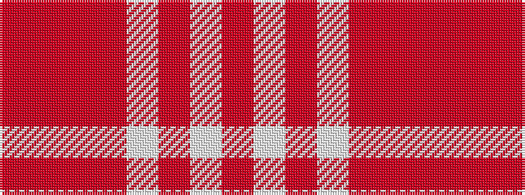

RRRRWRWR

It is a 8 stripe tartan.

<figure class="pat-woven">

<figcaption>idealised sample</figcaption>
</figure>

## Colour Sequence



## Tartans with this colour sequence

| Tartans |
|---------------|
| [Gigha, Cherry (Dance)](/variants/s8/ri4r3ri18rii18w18rii1w2rii4~x2/)|
||
