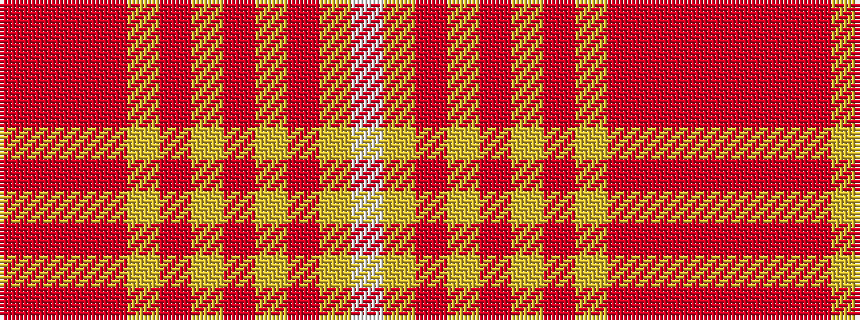

RRRRYRYRYRYW

It is a 12 stripe tartan.

<figure class="pat-woven">

<figcaption>idealised sample</figcaption>
</figure>

## Colour Sequence



## Tartans with this colour sequence

| Tartans |
|---------------|
| [Qatar Airways](/variants/s12/m3o2m6o21lr2o4lr3o3lr4o2lr13w2~x2/)|
||
