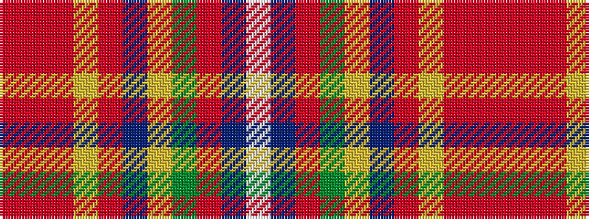

RRRYRBYGRBW

It is a 11 stripe tartan.

<figure class="pat-woven">

<figcaption>idealised sample</figcaption>
</figure>

## Colour Sequence



## Tartans with this colour sequence

| Tartans |
|---------------|
| [Porcupine Fancy Tartan Tartan Number: 1303. Earliest known date: 1969 Some mention of MacDougall and a Wilson connection. See products available Copyright © Blair Urquhart, Comrie, 2015](/setts/s11/o1r1o3lo1o1do8ly7g1o1t1w1~x2/)|
||
