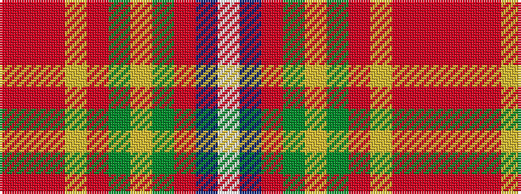

RRRYRGYGRBW

It is a 11 stripe tartan.

<figure class="pat-woven">

<figcaption>idealised sample</figcaption>
</figure>

## Colour Sequence



## Tartans with this colour sequence

| Tartans |
|---------------|
| [Porcupine](/setts/s11/o1r1o3lo1o1dy8ly7g1o1t1w1~x4/)|
||
