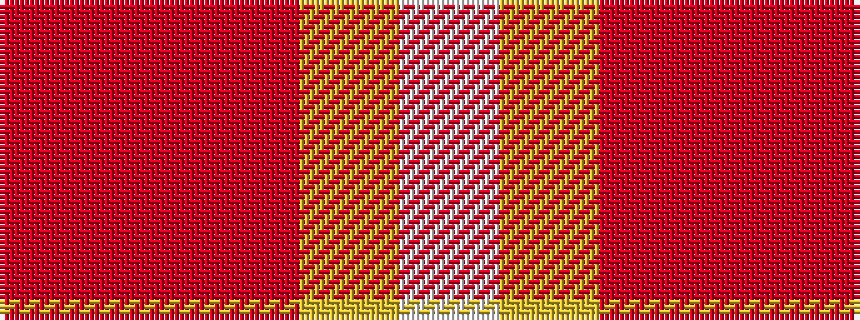

RRRYW

It is a 5 stripe tartan.

<figure class="pat-woven">

<figcaption>idealised sample</figcaption>
</figure>

## Colour Sequence



## Tartans with this colour sequence

| Tartans |
|---------------|
| [Love (Fashion)](/variants/s5/rii1ri4r10lo2w1~x4/)|
||
