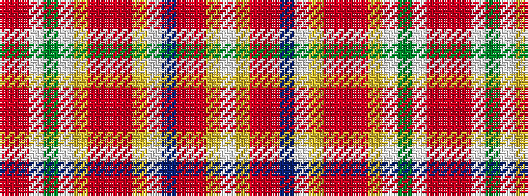

RRWGWYRRRYWBRRYW

It is a 16 stripe tartan.

<figure class="pat-woven">

<figcaption>idealised sample</figcaption>
</figure>

## Colour Sequence



## Tartans with this colour sequence

| Tartans |
|---------------|
| [North West, Mounted Police](/setts/s16/r39ri3w2g14w2ly4r4ri2r4ly4w2t12ri6r6ly7w2~x2/)|
||
