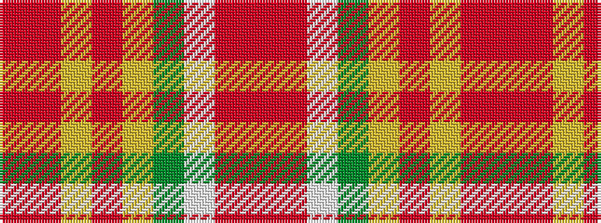

RRWGYRYRR

It is a 9 stripe tartan.

<figure class="pat-woven">

<figcaption>idealised sample</figcaption>
</figure>

## Colour Sequence



## Tartans with this colour sequence

| Tartans |
|---------------|
| [Henry, W.A.](/setts/s9/o24r24w3g21ly2r1ly2o6r2~x2/)|
||
