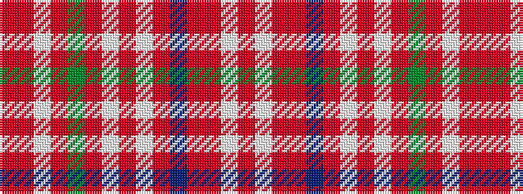

RRWRGRWRWRBRRWR

It is a 15 stripe tartan.

<figure class="pat-woven">

<figcaption>idealised sample</figcaption>
</figure>

## Colour Sequence



## Tartans with this colour sequence

| Tartans |
|---------------|
| [MacDougall #11](/setts/s15/r6m3w3r4dg33m3w3r4w3m3db9r33m3w4r4~x2/)|
||
| [MacDougall 10](/setts/s15/r6m3w3r4g33m3w3r4w3m3db9r33m3w4r4~x2/)|
||
