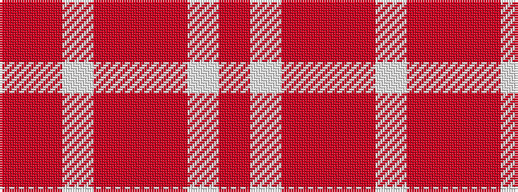

RRWRRRWR

It is a 8 stripe tartan.

<figure class="pat-woven">

<figcaption>idealised sample</figcaption>
</figure>

## Colour Sequence



## Tartans with this colour sequence

| Tartans |
|---------------|
| [Longniddry Burgundy (Dance)](/setts/s8/ri42rii2w2rii2ri5r12w32ri4~x2/)|
||
| [Longniddry, dress Burgundy](/setts/s8/rii42r2w2r2rii5ri12w32rii4~x2/)|
||
