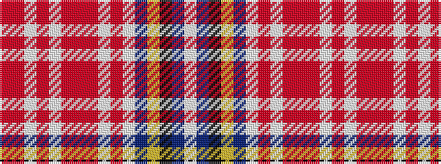

RRWRWRRRWRWBYKBW

It is a 16 stripe tartan.

<figure class="pat-woven">

<figcaption>idealised sample</figcaption>
</figure>

## Colour Sequence



## Tartans with this colour sequence

| Tartans |
|---------------|
| [Palmer, General W.J.](/setts/s16/r4o2lb2o23lb2o2r4o2lb2o2lb12dt6ly2k4n2lb2~x2/)|
||
