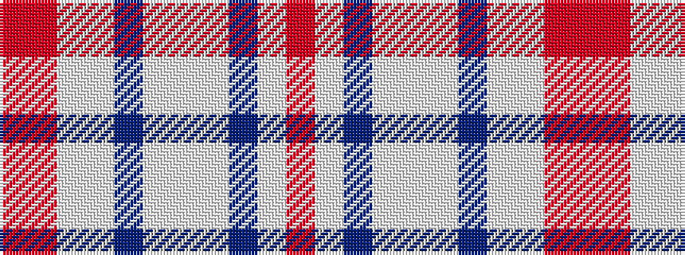

RRWWBWWWBWR

It is a 11 stripe tartan.

<figure class="pat-woven">

<figcaption>idealised sample</figcaption>
</figure>

## Colour Sequence



## Tartans with this colour sequence

| Tartans |
|---------------|
| [MacRae Grey (Fashion)](/setts/s11/r2o9lb4w2n22w2lb4w22n2w8r2~x2/)|
||
