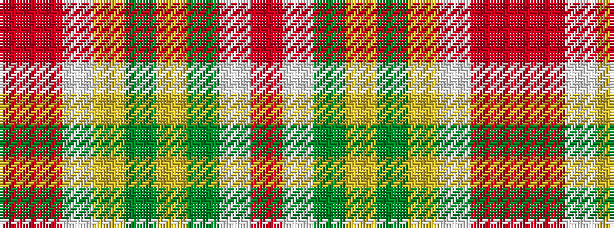

RRWYGYGWR

It is a 9 stripe tartan.

<figure class="pat-woven">

<figcaption>idealised sample</figcaption>
</figure>

## Colour Sequence



## Tartans with this colour sequence

| Tartans |
|---------------|
| [Bell's Whisky](/setts/s9/r3w5dy16lo2dy1lo40w6o3r2~x4/)|
||
