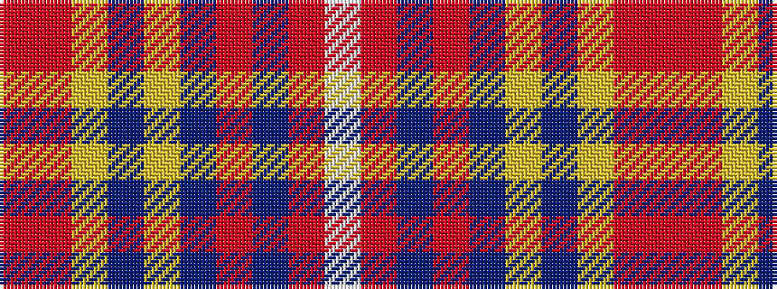

RRYBYBRBRW

It is a 10 stripe tartan.

<figure class="pat-woven">

<figcaption>idealised sample</figcaption>
</figure>

## Colour Sequence



## Tartans with this colour sequence

| Tartans |
|---------------|
| [MIT1951](/setts/s10/r24ri5lr7dt2lr4dt14r11dt3r3w4~x2/)|
||
