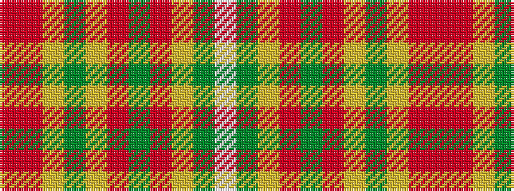

RRYGYRGRYGW

It is a 11 stripe tartan.

<figure class="pat-woven">

<figcaption>idealised sample</figcaption>
</figure>

## Colour Sequence



## Tartans with this colour sequence

| Tartans |
|---------------|
| [Bouguet, Adrian Dress (Personal)](/variants/s11/lb16dg5lo20o3dg3o3lo4g14lo2o2r1~x2/)|
||
