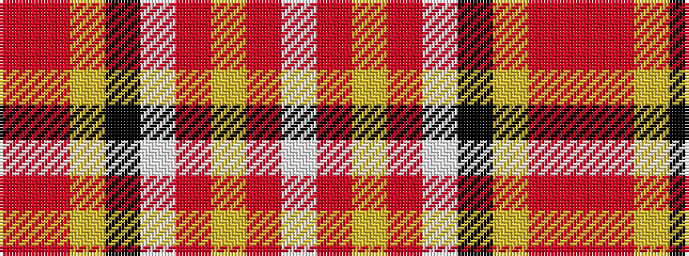

RRYKWRYRW

It is a 9 stripe tartan.

<figure class="pat-woven">

<figcaption>idealised sample</figcaption>
</figure>

## Colour Sequence



## Tartans with this colour sequence

| Tartans |
|---------------|
| [Etive, Burgundy (Dance)](/setts/s9/ri15r1lg3k1w11ri3lg3r3w1~x4/)|
||
