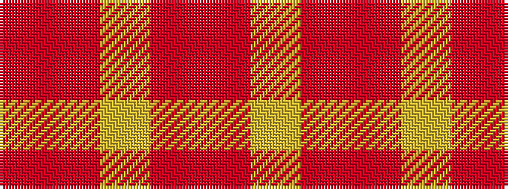

RRYRRY

It is a 6 stripe tartan.

<figure class="pat-woven">

<figcaption>idealised sample</figcaption>
</figure>

## Colour Sequence



## Tartans with this colour sequence

| Tartans |
|---------------|
| [Kozlosky (Personal)](/setts/s6/ly21r8r14ly6r3r10~x2/)|
||
| [Kozlosky, Kilt](/setts/s6/ly42r15r28ly12r6r20/)|
||
