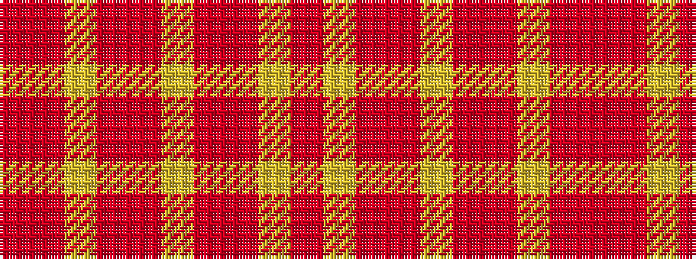

RRYRRYRRYR

It is a 10 stripe tartan.

<figure class="pat-woven">

<figcaption>idealised sample</figcaption>
</figure>

## Colour Sequence



## Tartans with this colour sequence

| Tartans |
|---------------|
| [Kozlosky (Personal)](/setts/s10/ly21r8r14ly6r3r10~x2/)|
||
