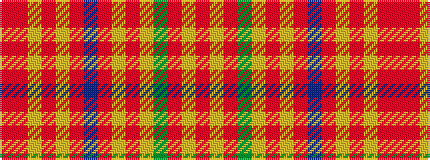

RRYRYRBRYRYGRYR

It is a 15 stripe tartan.

<figure class="pat-woven">

<figcaption>idealised sample</figcaption>
</figure>

## Colour Sequence



## Tartans with this colour sequence

| Tartans |
|---------------|
| [MacPherson 1](/variants/s15/r13lr4r13g28lr3o26lr10o2dr2o2lr10r14lr4o4r4~x2/)|
||
