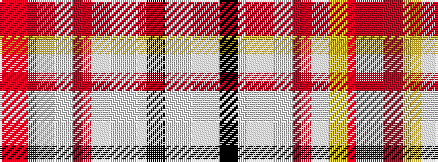

RRYWRWWWKWW

It is a 11 stripe tartan.

<figure class="pat-woven">

<figcaption>idealised sample</figcaption>
</figure>

## Colour Sequence



## Tartans with this colour sequence

| Tartans |
|---------------|
| [Manchester Blues Dress (Comm)](/variants/s11/w26lb9k2lb2w2lb2o11lb8ly2o2r2~x2/)|
||
| [Manchester Blues Modern](/variants/s11/lb26w9k2w2lb2w2o11w8ly2o2r2~x2/)|
||
