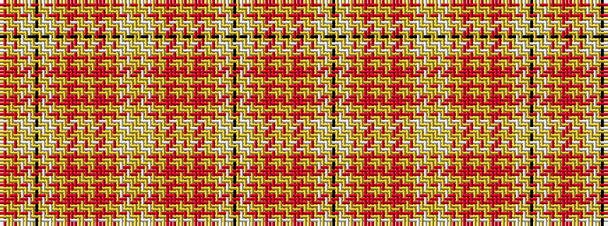

RRYYRYWYWYKYWYWYRYYRRRYYRYYRRRYYRYWYWYYYWYWYRYYRRRYYRYYRRRYYRYWYWYKYWYWYRYYRRRYYR

It is a 81 stripe tartan.

<figure class="pat-woven">

<figcaption>idealised sample</figcaption>
</figure>

## Colour Sequence



## Tartans with this colour sequence

| Tartans |
|---------------|
| [Unidentified Scarlett #13](/variants/s81/o6lr3lo3r3o1r3lo3lr3o7lr3lb3lr1lb3lr24k4lr24lb3lr1lb3lr3o7lr3lo3r3o1r3lo3lr3o7lr3lo3r3o1r3lo3lr3o7lr3lb3lr1lb3lr24lo4lr24lb3lr1lb3lr3o7lr3lo3r3o1r3lo3lr3o7lr3lo3r3o1r3lo3lr3o7lr3lb3lr1lb3lr24k4lr24lb3-h8b85b6c6dc99fd8d/)|
||
