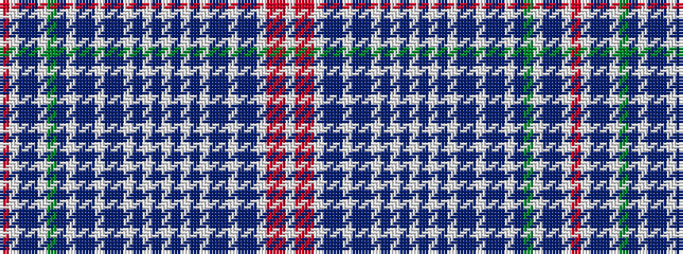

RWBBWGBWBBWBBWBWBWBWBWBBWBBWRRW

It is a 31 stripe tartan.

<figure class="pat-woven">

<figcaption>idealised sample</figcaption>
</figure>

## Colour Sequence



## Tartans with this colour sequence

| Tartans |
|---------------|
| [Brides Plaid](/setts/s31/r4w1t2p4w1g2db8w1p2t2w1t2p2w1p16w1p6w1p6w1p16w1p2t2w1t2p2w1r8r6w1~x2/)|
||
| [Brides Plaid Artifact Tartan Tartan Number: 1680. Earliest known date: 1730 Previously listed as unidentified. See products available Copyright © Blair Urquhart, Comrie, 2015](/setts/s31/r4w1t2dp4w1g2db8w1dp2t2w1t2dp2w1dp16w1dp6w1dp6w1dp16w1dp2t2w1t2dp2w1r8r6w1~x2/)|
||
