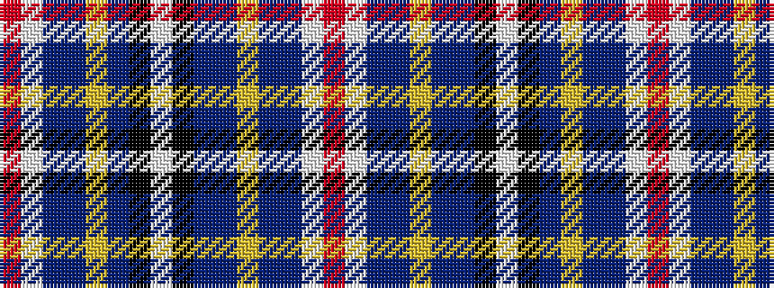

RWBBYBBKWKBYBBWR

It is a 16 stripe tartan.

<figure class="pat-woven">

<figcaption>idealised sample</figcaption>
</figure>

## Colour Sequence



## Tartans with this colour sequence

| Tartans |
|---------------|
| [Buchanan, John & Isabella](/setts/s16/r1w1db8b12ly1b1k2w3k6db1b1ly1b1db1w1r1~x6/)|
||
