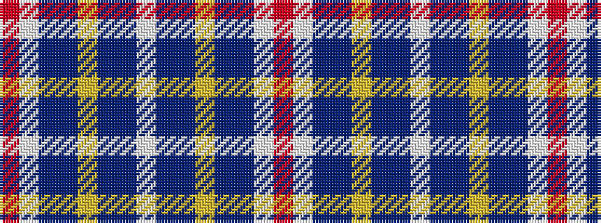

RWBBYBBWBBYBBWR

It is a 15 stripe tartan.

<figure class="pat-woven">

<figcaption>idealised sample</figcaption>
</figure>

## Colour Sequence



## Tartans with this colour sequence

| Tartans |
|---------------|
| [Buchanan, John & Isabella (Commemor)](/variants/s15/r1w1db8t12ly1t1db2w3db6t1ly1t1db1w1r1~x6/)|
||
