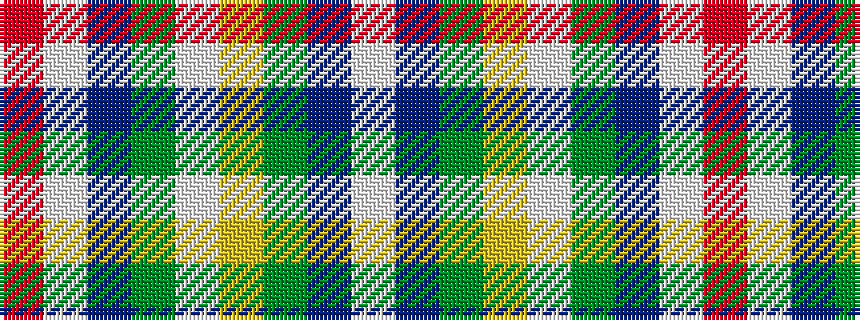

RWBGWYGBW

It is a 9 stripe tartan.

<figure class="pat-woven">

<figcaption>idealised sample</figcaption>
</figure>

## Colour Sequence



## Tartans with this colour sequence

| Tartans |
|---------------|
| [Mary, Queen of Scots](/variants/s9/r5w1db10g10w1ly1g2t2w1~x2/)|
||
