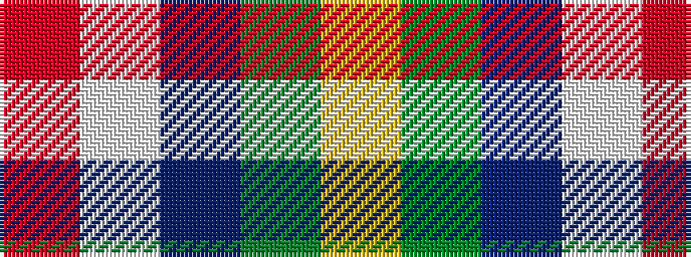

RWBGY

It is a 5 stripe tartan.

<figure class="pat-woven">

<figcaption>idealised sample</figcaption>
</figure>

## Colour Sequence



## Tartans with this colour sequence

| Tartans |
|---------------|
| [Centennial-King George Lodge No.171](/setts/s5/r2w7b30dg36ly2~x2/)|
||
| [Centennial-King George Lodge No.171](/setts/s5/r2w7db30g36ly2~x2/)|
||
