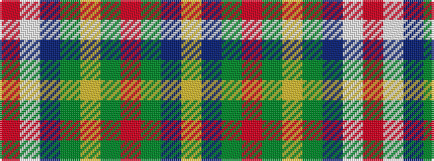

RWBGYGRGBY

It is a 10 stripe tartan.

<figure class="pat-woven">

<figcaption>idealised sample</figcaption>
</figure>

## Colour Sequence



## Tartans with this colour sequence

| Tartans |
|---------------|
| [Lanark Highlands](/variants/s10/o2w11t3g2ly1g1r2g10db4lo2~x4/)|
||
