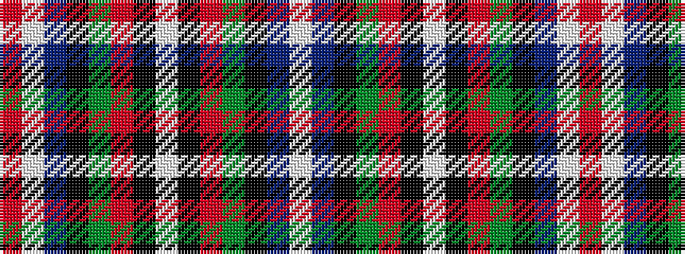

RWBKGRKWKRGKBW

It is a 14 stripe tartan.

<figure class="pat-woven">

<figcaption>idealised sample</figcaption>
</figure>

## Colour Sequence



## Tartans with this colour sequence

| Tartans |
|---------------|
| [Scottish Prison Service](/setts/s14/w4b30k3g20r4k1w3k1r4g20k3b30w4r2~x2/)|
||
