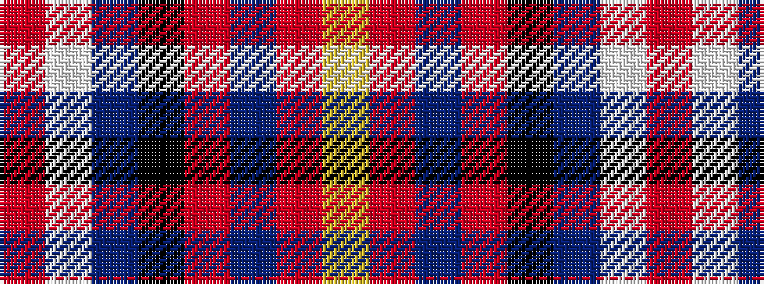

RWBKRBRY

It is a 8 stripe tartan.

<figure class="pat-woven">

<figcaption>idealised sample</figcaption>
</figure>

## Colour Sequence



## Tartans with this colour sequence

| Tartans |
|---------------|
| [Brodie](/setts/s8/r48lb4db4k4r12db4r1ly4/)|
||
| [Brodie (W & A Smith)](/setts/s8/r48w4db4k4r12db4r1ly4~x2/)|
||
