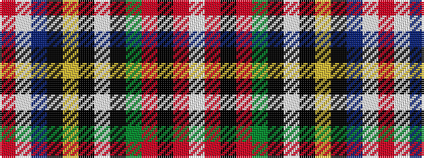

RWBKYKWKGRKRW

It is a 13 stripe tartan.

<figure class="pat-woven">

<figcaption>idealised sample</figcaption>
</figure>

## Colour Sequence



## Tartans with this colour sequence

| Tartans |
|---------------|
| [Victoria (Wilsons)](/variants/s13/r4w16t5k5ly2k2w2k2g5r5k2r2w2~x2/)|
||
