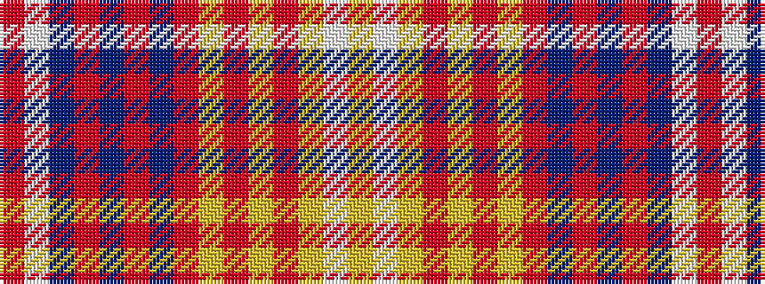

RWBRBRBRYRYRYWY

It is a 15 stripe tartan.

<figure class="pat-woven">

<figcaption>idealised sample</figcaption>
</figure>

## Colour Sequence



## Tartans with this colour sequence

| Tartans |
|---------------|
| [Winthrop University](/setts/s15/r2w2db6r2db2r2db1r20ly1r2ly2r2ly6w2ly2~x2/)|
||
| [Winthrop University (Corporate)](/setts/s15/r2lb2db6r2db2r2db1r20lo1r2lo2r2lo6lb2lo2~x2/)|
||
