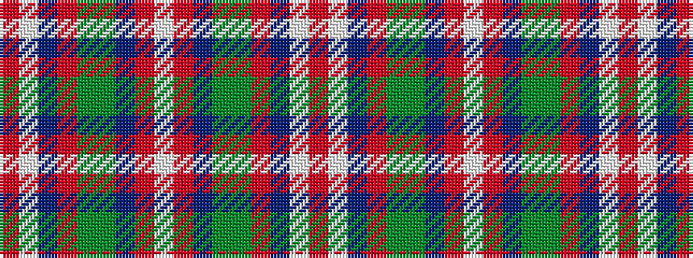

RWBRGGBRWRBGGRBWR

It is a 17 stripe tartan.

<figure class="pat-woven">

<figcaption>idealised sample</figcaption>
</figure>

## Colour Sequence



## Tartans with this colour sequence

| Tartans |
|---------------|
| [Spens, Fragment](/setts/s17/r50w2db7o2g33gi12db7o3w2o3db7gi12g33o2db7w2r17~x2/)|
||
