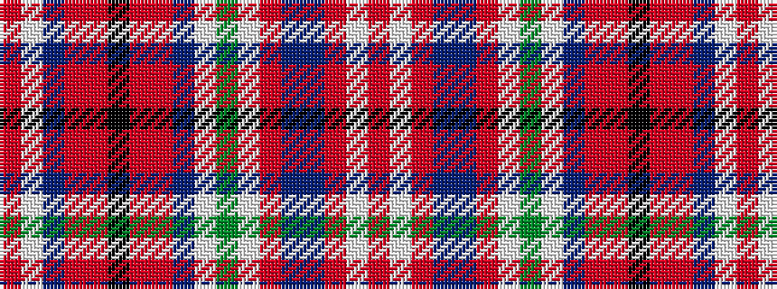

RWBRRKRRBWGWRBBRWR

It is a 18 stripe tartan.

<figure class="pat-woven">

<figcaption>idealised sample</figcaption>
</figure>

## Colour Sequence



## Tartans with this colour sequence

| Tartans |
|---------------|
| [Campbell, New Louden](/setts/s18/r25w2o5b2db2o5w2g12w2dp2o2r5k2r5o2dp2w2o9~x2/)|
||
