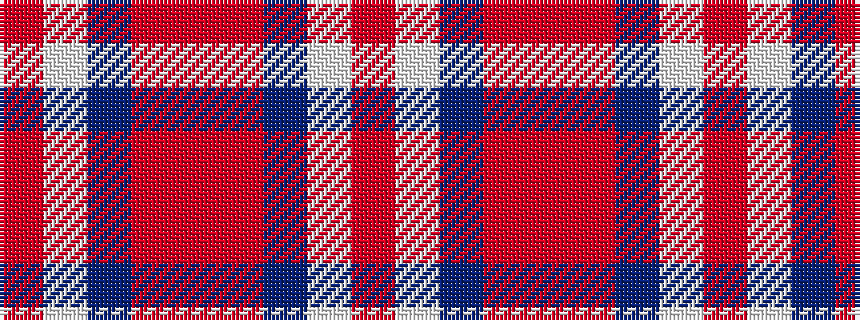

RWBRRRBWR

It is a 9 stripe tartan.

<figure class="pat-woven">

<figcaption>idealised sample</figcaption>
</figure>

## Colour Sequence



## Tartans with this colour sequence

| Tartans |
|---------------|
| [Wedding Day](/variants/s9/o4w1dp48r2m3r2dp3w1o4~x2/)|
||
