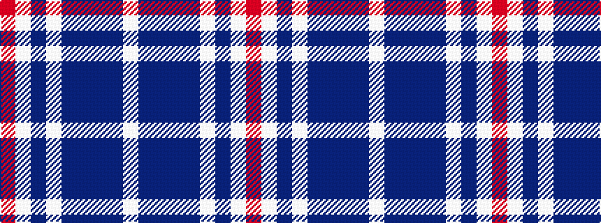

RWBWBBBBW

It is a 9 stripe tartan.

<figure class="pat-woven">

<figcaption>idealised sample</figcaption>
</figure>

## Colour Sequence



## Tartans with this colour sequence

| Tartans |
|---------------|
| [Fujisankei Serene (Corporate)](/variants/s9/o1lb6db4lb1db16n1db4n6lb1~x4/)|
||
