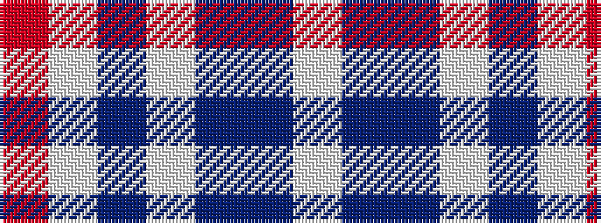

RWBWBBW

It is a 7 stripe tartan.

<figure class="pat-woven">

<figcaption>idealised sample</figcaption>
</figure>

## Colour Sequence



## Tartans with this colour sequence

| Tartans |
|---------------|
| [Bousie (Personal)](/setts/s7/w3t38db38w1t3w1r2~x2/)|
||
