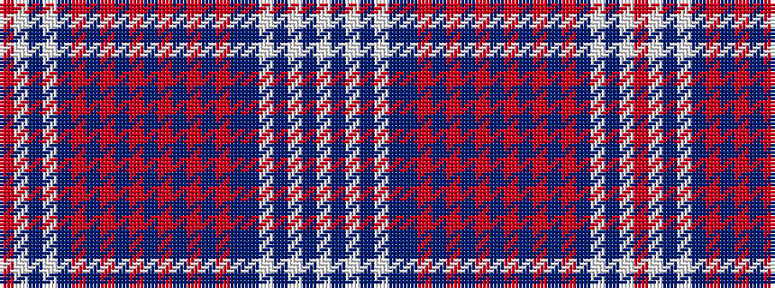

RWBWBRBRBRBRBRBRBBWBWBW

It is a 23 stripe tartan.

<figure class="pat-woven">

<figcaption>idealised sample</figcaption>
</figure>

## Colour Sequence



## Tartans with this colour sequence

| Tartans |
|---------------|
| [Alabama (Provisional)](/setts/s23/r5w3dt2w1dt4r1dt1r3dt1r1dt4o4t1o1t1o4dt4b25w1b2w2b2w3~x2/)|
||
