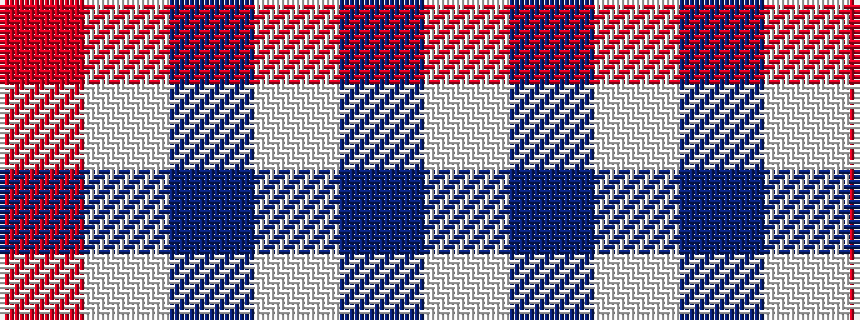

RWBWBW

It is a 6 stripe tartan.

<figure class="pat-woven">

<figcaption>idealised sample</figcaption>
</figure>

## Colour Sequence



## Tartans with this colour sequence

| Tartans |
|---------------|
| [Buchanan Dress Blue (Dance)](/setts/s6/w5db16w5db16w33r3~x2/)|
||
