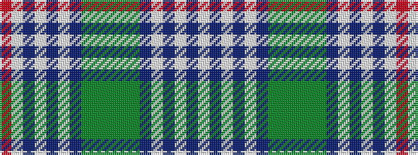

RWBWBWBGGGGGBWBWBW

It is a 18 stripe tartan.

<figure class="pat-woven">

<figcaption>idealised sample</figcaption>
</figure>

## Colour Sequence



## Tartans with this colour sequence

| Tartans |
|---------------|
| [Scotch House (Corporate)](/variants/s18/lb16db2lb2db2lb3db6y2y22y4y22y2db6lb3db2lb2db2lb16r3~x2/)|
||
